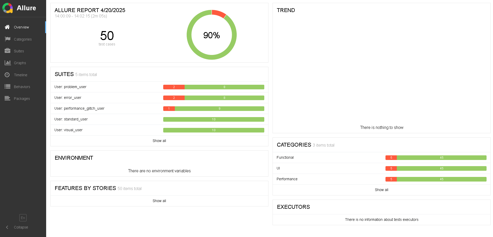
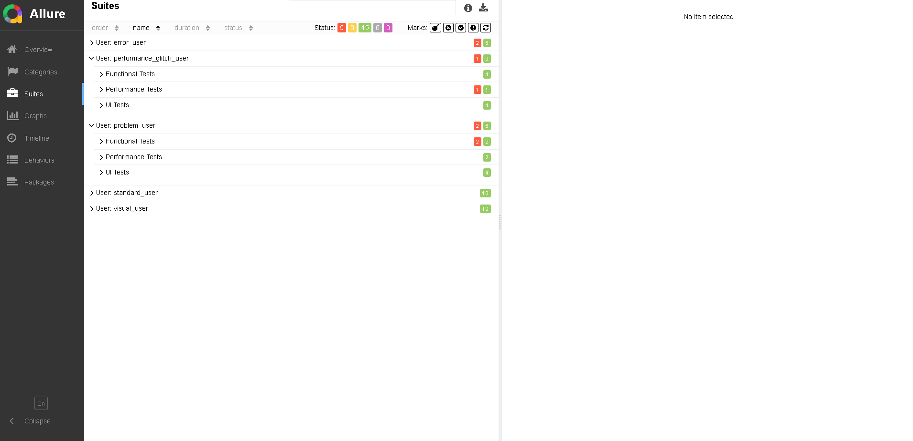

# **Automated Testing for SauceDemo**

This project is a data-driven automated testing framework for [**SauceDemo**](https://www.saucedemo.com) written in Python, designed to validate UI functionality, 
login authentication, shopping cart operations, and performance. It includes tests for user interactions, visual consistency, and system responsiveness, ensuring a seamless e-commerce experience.

This framework supports:
- CI/CD workflows with GitHub Actions
- Allure reports generated automatically 
- Headless execution for faster and efficient tests
- Test categorization (UI, performance, functional)
- Data-driven tests

The tests are implemented using:
- **Selenium** for automating web browser interactions.
- **Chrome WebDriver** to run tests on Chrome.
- **Pytest** for organizing, running, and reporting tests.
- **Allure** for visual test reports
- **GitHub Actions** for CI/CD workflows and deploying allure reports

## Test Cases
Below is the list of test cases for each user:

1. Login completes within 3 seconds
2. Logout completes within 3 seconds
3. Add item to cart
4. Remove item from cart
5. Continue shopping from cart page
6. Complete checkout process
7. Interact with all buttons
8. Display all images correctly
9. Display layout correctly in both desktop and mobile views
10. Display font in correct size

A detailed list of test cases, including test types, steps, and expected results, can be found here: 
[**Swag Labs Test Cases**](https://docs.google.com/spreadsheets/d/1QyHx-_dJrUHkXe4uBeoVitd3-3S0u8P9eQRnES6aiCM/edit?usp=sharing)

This document outlines functional, UI, and performance test cases used to validate the application's behavior.

## Results
The full test report is available here:  [**Allure Report**](https://enerko.github.io/saucedemo-selenium-tests/)

Below is an overview of all executed tests:

The tests are categorized by user type and test category (Functional, UI, Performance). As seen in the image below, performance_glitch_user failed a performance test related to login duration but passed all other checks. On the other hand, problem_user failed two functional tests. This demonstrates that the test suite is correctly identifying user-specific issues and validating expected behaviors.

